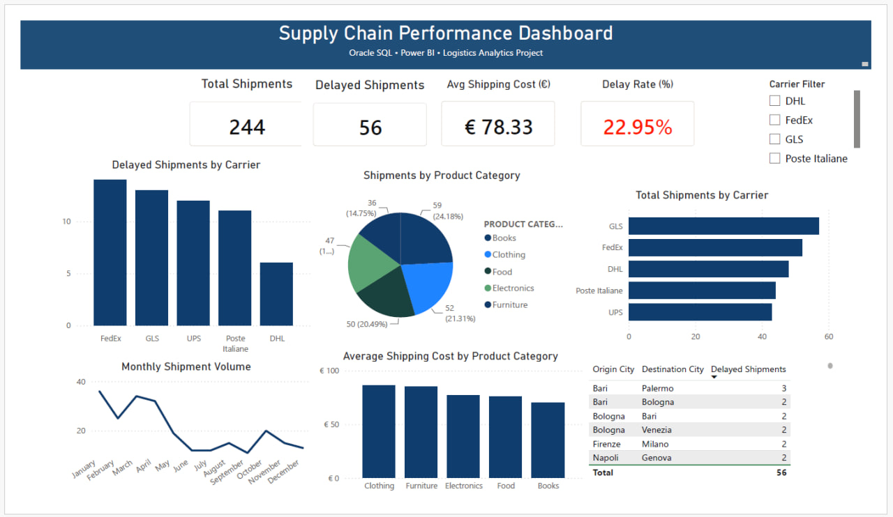
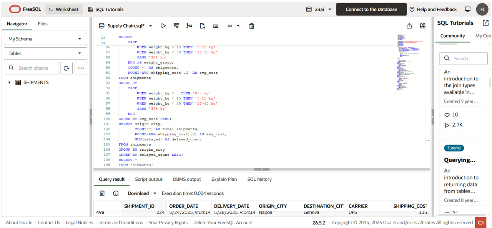

# Supply Chain Performance Dashboard

## Project Overview

This project demonstrates an end-to-end Supply Chain Analytics solution built using Oracle SQL and Power BI.

The objective was to analyze shipment operations, carrier performance, shipping costs, product categories, and delivery delays through interactive dashboards and KPI monitoring.

---

## Tools Used

- Oracle SQL
- Power BI
- Data Visualization
- Business Intelligence

---

## Key KPIs

- Total Shipments
- Delayed Shipments
- Average Shipping Cost
- Delay Rate (%)

---

## Dashboard Features

### Carrier Performance Analysis
- Total shipments by carrier
- Delayed shipments by carrier

### Product Category Analysis
- Shipment distribution by category
- Average shipping cost by category

### Trend Analysis
- Monthly shipment volume trends

### Route Analysis
- Origin and destination shipment routes
- Delayed shipment tracking

---

## Business Insights

- Identified carriers with the highest delay rates.
- Compared shipping costs across product categories.
- Monitored shipment trends throughout the year.
- Evaluated route-level delivery performance.

---

## Dashboard Preview



---
## SQL Analysis

The project database was built in Oracle SQL and populated with simulated shipment records.

Key analyses included:

* Carrier performance evaluation
* Delay rate calculation
* Shipping cost analysis
* Route-level performance analysis
* Product category insights

Example Query:

```sql
SELECT carrier,
       COUNT(*) AS total_shipments,
       ROUND(AVG(shipping_cost), 2) AS avg_cost,
       SUM(delayed) AS delayed_count,
       ROUND(SUM(delayed) / COUNT(*) * 100, 1) AS delay_rate_pct
FROM shipments
GROUP BY carrier
ORDER BY delay_rate_pct DESC;
```
## Oracle Preview

## Author

Hamidreza Asiyaeimoghadam

Economics and Finance with Data Science Student

University of Turin
